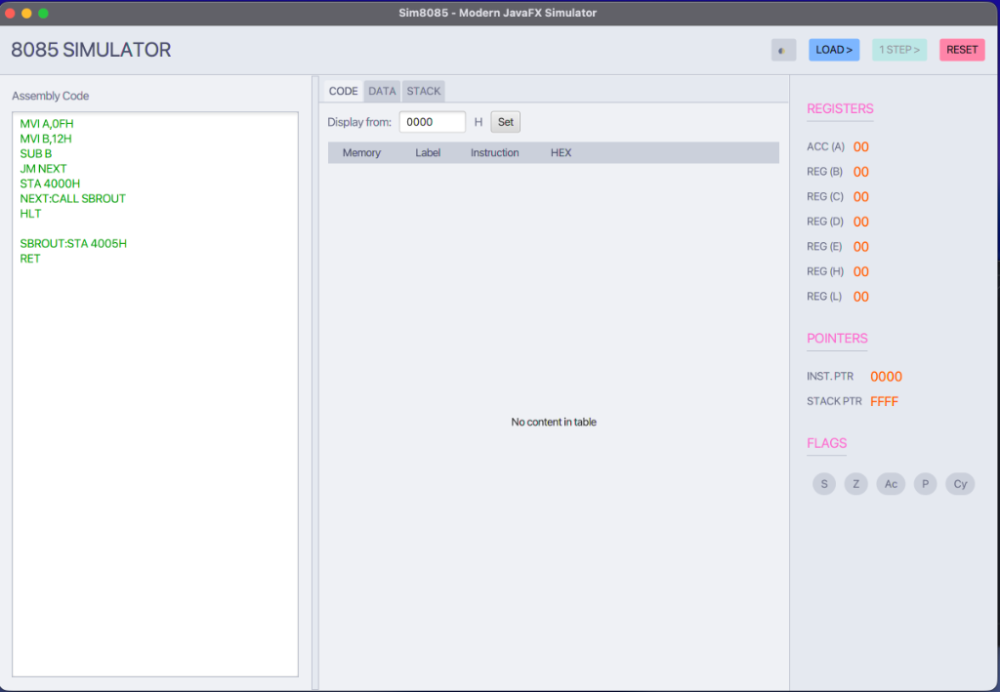

# 8085 Simulator

A modern, high-performance 8085 Microprocessor simulator built with Java. This tool allows users to write, compile, and execute 8085 Assembly Language Programs (ALP) with a real-time view of registers, flags, and memory.

## Features
- **Modern JavaFX GUI**: A clean, responsive interface with multi-theme support.
- **Dark & Light Modes**: Seamlessly switch between themes for a personalized experience.
- **Real-time Monitoring**: Track Accumulator (A), Registers (B, C, D, E, H, L), Flags, IP, and SP.
- **Instruction Execution**: Single-step execution with automatic row highlighting and scrolling.
- **Efficient Engine**: Optimized with Map-based instruction dispatch and algorithmic opcode parsing.



---

## Requirements
- **Java 17** or higher.
- **Maven 3.6+** (for building from source).

---

## Getting Started

### Development
To run the simulator in development mode or run tests:

```bash
# Clone the repository
git clone https://github.com/amanvishnani/8085.git
cd 8085

# Run tests
mvn test

# Run the JavaFX application
mvn javafx:run
```

### Production Build
To create a standalone executable JAR:

```bash
# Clean and package the application
mvn clean package

# Run the generated JAR
java -jar target/sim8085-1.0.1.jar
```

---

## Technical Details
The simulator was modernized in **Version 1.0.1**:
- **Build System**: Consolidated to Maven (Spring Boot 3.2.2).
- **Instruction Dispatch**: Optimized with a high-performance `Map<String, Runnable>` system.
- **Parser**: Re-engineered using an algorithmic approach for opcode resolution.
- **Java 17**: Upgraded to leverage modern language features.

---

## Authors
- **Aman Vishnani**: [GitHub](https://github.com/amanvishnani)
- **Darshan Sarje**: [GitHub](https://github.com/darshansarje)

---

## License
Copyright (C) 2016-2026 Aman Vishnani & Darshan Sarje

This program is free software: you can redistribute it and/or modify it under the terms of the GNU General Public License as published by the Free Software Foundation, either version 3 of the License, or (at your option) any later version.

